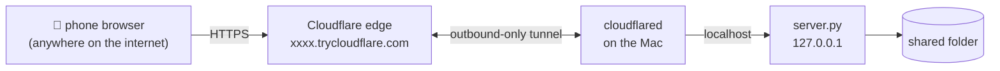

# 📦 ftransfer

**Send files from your Mac to your phone when nothing else works.**


AirDrop disabled? File sharing blocked by IT? Phone not allowed on the same
network? **ftransfer** shares a folder from your Mac through a
[Cloudflare quick tunnel](https://developers.cloudflare.com/cloudflare-one/connections/connect-networks/do-more-with-tunnels/trycloudflare/),
so your phone can browse and download the files from anywhere with just a
browser — no app to install, no accounts, no same-network requirement.

- **One command** — `./start.sh` prints a public URL, a fresh password, and a
  QR code to scan with your phone camera
- **Menu bar app** — or open FTransfer.app: pick folders, scan the QR window
- **Multiple folders** — share several directories at once; the root page
  lists each one
- **Password-protected** — HTTPS + Basic Auth with a new random password per run
- **Download-only** — nothing on the Mac can be modified from the phone
- **Zero dependencies** — the server is a single stdlib-only Python file;
  the only external tool is `cloudflared`
- **Mobile-friendly UI** — file icons, sizes, previews, one-tap downloads,
  dark mode

<br clear="right">

## Quick start (CLI)

```sh
brew install cloudflared        # one-time
git clone https://github.com/Sagn1k/ftransfer && cd ftransfer

./start.sh                      # shares ./shared (created if missing)
```

You'll get:

```
 ─────────────────────────────────────────────────────
  ftransfer is live

  URL       https://random-words-here.trycloudflare.com
  Username  files   (anything works)
  Password  wmm28zt2mn
  Folder    /Users/you/ftransfer/shared
 ─────────────────────────────────────────────────────
  [QR code — scan it with your phone camera]
```

Open the URL on the phone, sign in with any username + that password, tap a
file to preview it or **↓** to download. `Ctrl+C` stops sharing.

```sh
./start.sh ~/Downloads               # share any folder
./start.sh ~/Downloads ~/Desktop     # share several folders at once
FT_PASSWORD=mypass ./start.sh        # fixed password
PORT=9000 ./start.sh                 # fixed port
caffeinate -i ./start.sh             # keep the Mac awake while sharing
```

Install `qrencode` (`brew install qrencode`) to get the terminal QR code.

## Menu bar app


A native macOS menu bar app wraps the same flow: pick folders, get a QR
window, copy the link/password, stop with one click.

```sh
make app                       # builds clients/mac/FTransfer.app (needs Xcode CLT)
open clients/mac/FTransfer.app
```

On launch the app immediately asks which folder(s) to share (⌘-click to
select several). Once the tunnel is up, a window pops up with the QR code,
the password, and a Stop button. Afterwards the app lives in the **menu bar**
as a 📦 icon (top-right) — click it to show the QR again, copy the link, or
stop sharing. Re-opening the app from Finder also brings the window back.

> On MacBooks with a notch, a crowded menu bar can hide new icons — if you
> don't see 📦, close some other menu bar apps or use the app's windows.

The app is built locally and unsigned — that's why there's no prebuilt
download.

<br clear="right">

## How it works



`server.py` serves one folder over HTTP with Basic Auth, bound to
`127.0.0.1` only. `cloudflared` opens an **outbound** connection to
Cloudflare and gets a throwaway public hostname — no ports are opened on the
Mac, no firewall or router changes, which is why it works on locked-down
machines and networks.

### Security model

- The URL is a random unguessable subdomain **and** every request requires
  the password (checked with constant-time comparison).
- New URL + new password on every run; both die when you hit `Ctrl+C`.
- The server never binds to the network — only the tunnel can reach it.
- Read-only: `GET`/`HEAD` only. Dotfiles are hidden and never served.
  Path traversal and symlink escapes are blocked.
- Trade-off to be aware of: traffic transits Cloudflare, and anyone holding
  both the URL and password can read the shared folder while it runs. Share
  only what you need, stop it when done.

## Troubleshooting

| Symptom | Fix |
|---|---|
| URL prints but the page shows Cloudflare error 1033 / HTTP 530 | Your network drops UDP 7844 (QUIC). ftransfer already defaults to the TCP transport (`CF_PROTOCOL=http2`); if you overrode it, unset it. |
| `cloudflared not found` | `brew install cloudflared` |
| Downloads stall mid-transfer | The Mac went to sleep — use `caffeinate -i ./start.sh`. |
| Video won't play inline on iPhone | Use the ↓ button to download it instead (range requests are supported, but codecs vary). |
| Need a URL that never changes | Quick tunnels are throwaway by design. Create a free Cloudflare account and a [named tunnel](https://developers.cloudflare.com/cloudflare-one/connections/connect-networks/), then point it at `http://127.0.0.1:8420`. |

## Development

```
server.py            the whole server (stdlib only)
start.sh             CLI launcher: server + tunnel + QR
clients/mac/         Swift menu bar app (build.sh → FTransfer.app)
tests/smoke.sh       black-box tests: auth, ranges, traversal, listings
.github/workflows/   CI: smoke tests on Linux, app build on macOS
```

```sh
make test            # run the smoke tests
make app             # build the menu bar app
make start           # share ./shared
```

## License

[MIT](LICENSE)
